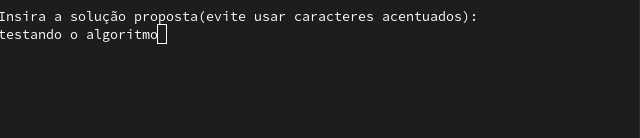
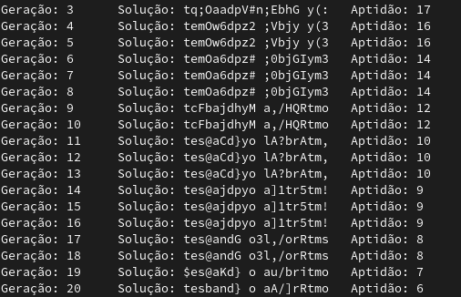
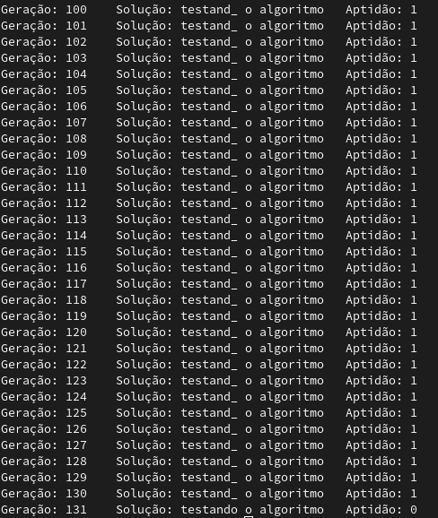

# Algoritmos genéticos

Algoritmo feito em python para descrever o funcionamento de um algoritmo genético passo-a-passo. Implementação baseada no <a href="https://www.geeksforgeeks.org/genetic-algorithms/">exemplo sobre algoritmos genéticos</a> do GeeksForGeeks.

 

## O que é um algoritmo genético?

Algoritmos genéticos são modelos matemáticos baseados em conceitos de biologia evolutiva, frequentemente utilizados na otimização de problemas ao gerar um conjunto de soluções que se adaptam evolutivamente até obter o que seria a solução ideal mais próxima para determinado problema.

## Como o algoritmo funciona?

Da forma como fora implementado, o algoritmo pedirá a solução final do problema para que, sabendo disso, ele consiga implementar uma série de heurísticas a partir de um determinado ponto, até chegar na solução que lhe foi proposta. Nesse caso em específico o algoritmo deve encontrar a string "testando o algoritmo".

Após isso o algoritmo trabalhará através de várias funções que simulam comportamentos biológicos, como a criação de gerações, cruzamento e mutações entre as possíveis soluções. Como neste caso o objetivo é encontrar uma determinada sequência de caracteres, o algoritmo testará várias e várias sequências de combinações para encontrar o resultado correto, usando das heurísticas propostas para tal.

Passando gerações de possíveis resultados, nota-se que a solução vai chegando cada vez mais perto do ideal, onde todas essas possíveis soluções estão sendo encontradas através de cruzamentos entre os mesmos, onde o caractere que faz parte da solução é preservado na geração seguinte e assim suscetivamente até que se encontre o resultado esperado.

 